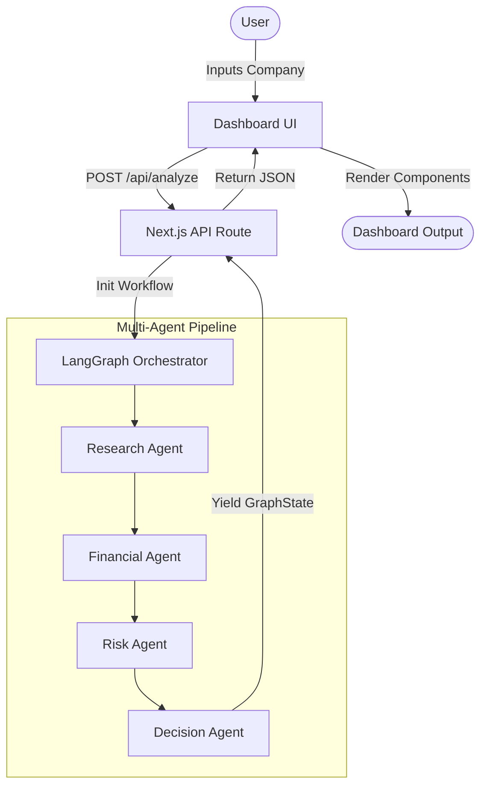
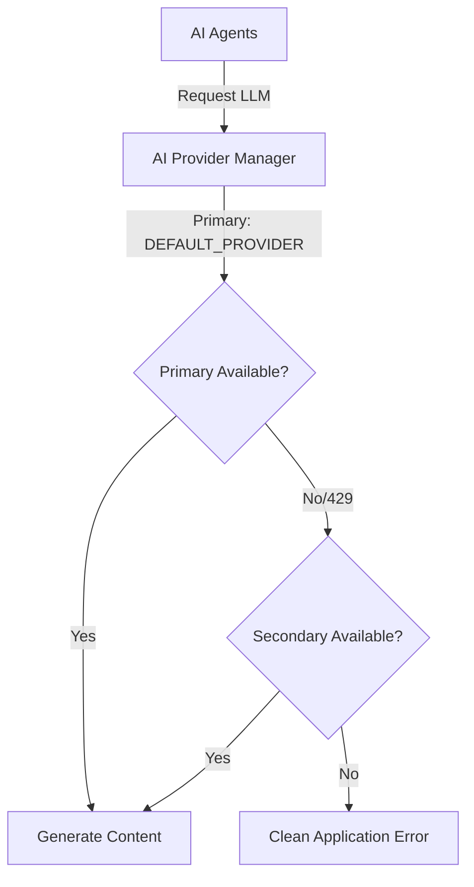
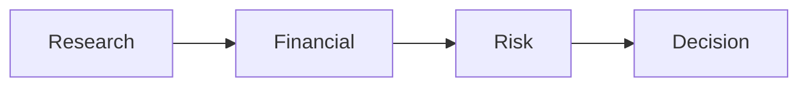

# 📈 AI Investment Research Agent

> **Institutional-grade financial research powered by multi-agent reasoning.**  
> An autonomous system that aggregates real-time data, analyzes financial health, evaluates risks, and synthesizes actionable investment recommendations using a deterministic AI workflow.


---

## 📸 Preview

  
*Professional dashboard presenting the synthesized research reports.*

  
*Real-time LangGraph workflow execution.*

---

## 📑 Table of Contents

- [Overview](#-overview)
- [Features](#-features)
- [System Architecture](#-system-architecture)
- [Tech Stack](#-tech-stack)
- [Project Structure](#-project-structure)
- [Multi-Agent Architecture](#-multi-agent-architecture)
- [Workflow Explanation](#-workflow-explanation)
- [AI Provider Fallback](#-ai-provider-fallback)
- [Installation](#-installation)
- [Example Output](#-example-output)
- [Screenshots](#-screenshots)
- [Engineering Decisions](#-engineering-decisions)
- [Performance](#-performance)
- [Roadmap](#-roadmap)
- [Future Improvements](#-future-improvements)
- [Contributing](#-contributing)
- [License](#-license)

---

## 🔍 Overview

**Problem Statement:** Performing thorough investment research requires aggregating massive amounts of unstructured data, analyzing complex financial health metrics, evaluating market positioning, and identifying hidden risks. Manual research is extremely time-consuming and heavily prone to human bias and fatigue.

**Solution:** The AI Investment Research Agent solves this by orchestrating a team of specialized AI agents. Instead of relying on a single prompt, the system divides the cognitive load. One agent gathers data, another acts as a financial analyst, a third acts as a risk manager, and the final agent synthesizes a holistic decision.

**Why this project exists:** To demonstrate how to build deterministic, highly typed, production-ready AI agent workflows using LangGraph in a modern Next.js ecosystem. It bridges the gap between fragile AI experiments and resilient, enterprise-grade AI applications.

---

## ✨ Features

| Feature | Description |
| ------- | ----------- |
| **Multi-Agent Workflow** | Specialized agents (Research, Financial, Risk, Decision) collaborate to build a comprehensive report. |
| **LangGraph Orchestration** | Deterministic, graph-based execution pipeline passing strongly typed state between nodes. |
| **AI Provider Fallback** | Automatic failover between Gemini and Groq to bypass strict rate limits and ensure maximum uptime. |
| **Structured Outputs** | Native Zod schema validation ensures every AI response strictly adheres to the UI contract. |
| **Professional Dashboard** | A highly polished, responsive Next.js frontend built with Tailwind v4 and shadcn/ui. |
| **Dark / Light Theme** | First-class support for both system preferences with a seamless toggle. |
| **Evidence Tracking** | Full traceability mapping AI conclusions back to specific scraped URLs and articles. |
| **Workflow Progress** | Real-time visibility into the current execution state of the multi-agent pipeline. |

---

## 🏗️ System Architecture

### Overall System Architecture



### Provider Architecture



### Workflow



---

## 💻 Tech Stack

| Technology | Purpose |
| ---------- | ------- |
| **Next.js 15** | Full-stack React framework (App Router) for the API and Dashboard. |
| **TypeScript** | Strict typing for API contracts, Zod schemas, and UI props. |
| **LangGraph.js** | Agent orchestration, state management, and execution graphs. |
| **LangChain.js** | LLM abstraction, structured outputs, and tooling interfaces. |
| **Gemini 1.5 Flash** | Primary reasoning engine chosen for high speed and low latency. |
| **Groq (LLaMA 3.3)** | Ultra-fast secondary reasoning engine used for fallback resilience. |
| **Tavily** | AI-optimized search engine for real-time web scraping. |
| **Tailwind CSS v4** | Utility-first styling for the professional dashboard. |
| **shadcn/ui** | Accessible, customizable component primitives (Accordions, Badges, etc.). |

---

## 📁 Project Structure

```text
src/
├── agents/        # The specialized AI agents
│   ├── research/  # Gathers data via Tavily Search
│   ├── financial/ # Analyzes business quality and metrics
│   ├── risk/      # Identifies and categorizes threats
│   └── decision/  # Synthesizes the final recommendation
├── app/           # Next.js App Router
│   ├── api/       # API Routes (e.g., /api/analyze)
│   └── page.tsx   # The main Dashboard UI
├── components/    # Reusable React components
│   ├── dashboard/ # Custom UI blocks (Report Accordions, Recommendation Card)
│   └── ui/        # shadcn/ui primitives
├── services/      # Shared infrastructure layer
│   ├── ai-provider.ts # The central LLM fallback manager
│   └── env.ts     # Zod environment variable validation
├── types/         # Global TypeScript interfaces and Zod schemas
└── workflow/      # LangGraph state definition and graph execution
```

---

## 🧠 Multi-Agent Architecture

| Agent | Responsibility | Input | Output |
| ----- | -------------- | ----- | ------ |
| **Research** | Aggregates real-time news, competitor data, and leadership info. | Company Name | `ResearchReport` |
| **Financial** | Evaluates financial health, operational strength, and growth potential. | `ResearchReport` | `FinancialReport` |
| **Risk** | Identifies threats, classifies severity, and suggests mitigations. | `ResearchReport` + `FinancialReport` | `RiskReport` |
| **Decision** | Synthesizes all data to formulate a final Invest/Hold/Pass verdict. | All previous reports | `DecisionReport` |

---

## 🔄 Workflow Explanation

1. **User Input:** The user types a company name (e.g., "Tesla") into the dashboard and clicks Analyze.
2. **API Dispatch:** The frontend sends a POST request to `/api/analyze`.
3. **Graph Initialization:** The backend initializes a deterministic LangGraph workflow with an empty `GraphState`.
4. **Research Phase:** The Research Agent uses the Tavily search tool to scrape recent data. It structures the findings into a comprehensive `ResearchReport`.
5. **Financial Phase:** The Financial Agent analyzes the `ResearchReport` exclusively, scoring the company's market position, innovation, and financial health.
6. **Risk Phase:** The Risk Agent synthesizes the `ResearchReport` and `FinancialReport` to build a matrix of High/Medium/Low priority risks.
7. **Decision Phase:** The Decision Agent weighs all generated evidence, producing a final "Strong Invest" to "Strong Pass" verdict along with reasoning.
8. **UI Rendering:** The fully hydrated `GraphState` is returned to the frontend, instantly mapping the strictly typed JSON into beautiful interactive components.

---

## 🛡️ AI Provider Fallback

To guarantee maximum reliability, the system implements an intelligent AI Provider layer.

- **DEFAULT_PROVIDER:** Configurable via environment variables to select the primary engine (`gemini` or `groq`).
- **Gemini:** The default primary engine, providing massive context windows and excellent reasoning.
- **Groq:** The default fallback engine, utilizing open-source LLaMA 3.3 models for ultra-fast inferences.
- **Automatic Failover:** If the primary provider hits an HTTP 429 (Too Many Requests), exhausts its daily quota, or times out, the `ai-provider` manager catches the exception.
- **Rate Limit Handling:** The system seamlessly injects the secondary provider and re-attempts the exact same prompt and schema. 
- **Why it improves reliability:** Free-tier API keys are notoriously fragile. This fallback mechanism ensures that a multi-minute, multi-agent workflow isn't destroyed at the finish line by a sudden quota exhaustion.

---

## 🚀 Installation

Follow these steps to run the AI Investment Research Agent locally.

### 1. Clone the repository
```bash
git clone <repository-url>
cd ai-investment-research-agent
```

### 2. Install dependencies
```bash
npm install
```

### 3. Configure Environment Variables
Copy the example environment file:
```bash
cp .env.example .env.local
```

Populate `.env.local` with your API keys:

| Variable | Description |
| -------- | ----------- |
| `GOOGLE_API_KEY` | Your Google Gemini API Key. |
| `GROQ_API_KEY` | Your Groq API Key. |
| `TAVILY_API_KEY` | Your Tavily Search API Key. |
| `DEFAULT_PROVIDER` | Set to `gemini` or `groq`. |

### 4. Start the development server
```bash
npm run dev
```
Navigate to `http://localhost:3000` to access the dashboard.

---

## 📊 Example Output

When researching a company like **Tesla**, **Apple**, or **Microsoft**, the dashboard produces:

1. **Recommendation Card:** A prominent display showing "Invest", "Hold", or "Pass", alongside an overall confidence score and the AI's final reasoning.
2. **Workflow Progress Tracker:** Visual confirmation that all 4 agents successfully completed their tasks.
3. **Research Accordion:** Deep dives into the company's business model, leadership, and core competitors.
4. **Financial Accordion:** Progress bars detailing Growth Potential (0-100), Operational Strength (0-100), and Financial Health (0-100).
5. **Risk Accordion:** Categorized badges highlighting specific threats, their severity (Very Low to Very High), and mitigation feasibility.
6. **Sources & Evidence:** A transparent list of the exact URLs and articles the agents used to formulate their conclusions.

---

## 📸 Screenshots

### Dashboard


### Workflow Progress


### Recommendation Card


### Research Report


### Financial Report


### Risk Report


### Decision Report


### Dark Mode / Light Mode


---

## 🛠️ Engineering Decisions

- **Why Next.js:** Provides the easiest way to combine a stunning React frontend with secure serverless API routes capable of running Node.js backend logic.
- **Why LangGraph:** Basic LangChain chains become impossible to debug at scale. LangGraph introduces stateful, cyclic graphs that provide immense visibility into the pipeline and pave the way for human-in-the-loop approvals.
- **Why Multi-Agent:** Monolithic prompts suffer from "attention collapse." By forcing different LLM instances to adopt specific personas (Financial Analyst vs Risk Manager), the depth and quality of the analysis skyrockets.
- **Why Structured Outputs (Zod):** UI components cannot parse raw markdown reliably. Binding Zod schemas to the LLM guarantees a predictable JSON contract that maps perfectly to React props.
- **Why Provider Fallback:** Multi-agent systems consume massive amounts of tokens. Implementing a fallback layer completely mitigates the fragility of free-tier rate limits.
- **Trade-offs made:** Execution is currently sequential rather than parallel. While parallel execution of the Financial and Risk agents would reduce latency, sequential execution allows the Decision agent to perform holistic reasoning over a fully cohesive narrative.
- **Future Scalability:** The `GraphState` architecture allows infinite scaling. Adding an "ESG Agent" or a "Sentiment Agent" is as simple as dropping a new node into the graph without rewriting existing logic.

---

## ⚡ Performance

- **Sequential Workflow:** Prevents race conditions and ensures every agent has the maximum amount of context available.
- **Error Handling:** Graceful UI degradation. If the entire AI pipeline fails, the frontend presents a clean error while nesting the raw stack trace in a collapsible diagnostic block.
- **Typed Contracts:** Strict TypeScript boundaries between agents ensure the LangGraph state never becomes corrupted during execution.
- **Modular Design:** The `src/` directory rigidly separates UI primitives, agent logic, and shared infrastructure.

---

## 🗺️ Roadmap

- [x] Enterprise Project Setup
- [x] Shared AI & Infrastructure Services
- [x] Research Agent
- [x] Financial Agent
- [x] Risk Agent
- [x] Decision Agent
- [x] LangGraph Orchestration
- [x] Professional Dashboard UI
- [x] AI Provider Fallback Strategy
- [ ] Portfolio Comparison View
- [ ] Historical Financial Data API Integration
- [ ] User Authentication & Saving Reports
- [ ] Cloud Deployment (Docker/Vercel)
- [ ] PDF Report Export

---

## 🔮 Future Improvements

- **Streaming Workflow Updates:** Upgrade the backend to emit Server-Sent Events (SSE) so the UI can stream intermediate agent thoughts in real-time, reducing perceived latency.
- **Hard Quantitative Metrics:** Integrate deterministic financial APIs (Alpha Vantage, Yahoo Finance) to supplement the qualitative LLM analysis with hard P/E ratios, revenue growth, and historical charts.
- **Database Persistence:** Attach a PostgreSQL database (via Supabase or Prisma) to cache completed reports and track portfolio changes over time.

---

## 🤝 Contributing

Contributions are welcome! If you'd like to improve the AI Investment Research Agent, please follow these steps:
1. Fork the repository.
2. Create a new feature branch (`git checkout -b feature/amazing-feature`).
3. Commit your changes (`git commit -m 'Add amazing feature'`).
4. Push to the branch (`git push origin feature/amazing-feature`).
5. Open a Pull Request.

---

## 📄 License

This project is licensed under the [MIT License](LICENSE).
