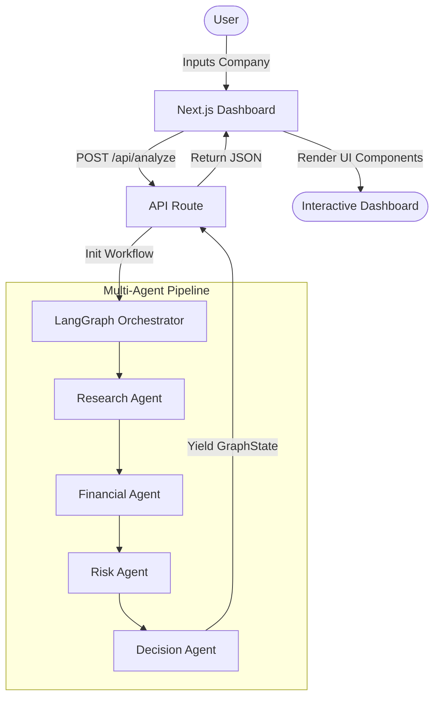
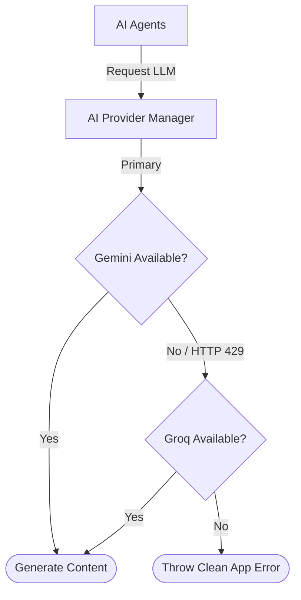

<div align="center">

# 📈 AI Investment Research Agent

**Institutional-grade financial research powered by autonomous multi-agent reasoning.**

[](https://nextjs.org/)
[](https://www.typescriptlang.org/)
[](https://langchain-ai.github.io/langgraph/)
[](https://tailwindcss.com/)
[](LICENSE)

An open-source system that aggregates real-time data, analyzes financial health, evaluates risks, and synthesizes actionable investment recommendations using a deterministic AI workflow.

---

</div>

## 📸 Preview


> *Professional dashboard presenting the synthesized research reports.*


> *Real-time LangGraph workflow execution.*

---

<details>
<summary><strong>📑 Table of Contents</strong></summary>

- [Overview](#-overview)
- [Key Features](#-key-features)
- [System Architecture](#-system-architecture)
- [Multi-Agent Pipeline](#-multi-agent-pipeline)
- [AI Provider Resilience](#-ai-provider-resilience)
- [Quick Start](#-quick-start)
- [Project Structure](#-project-structure)
- [Engineering Decisions](#-engineering-decisions)
- [Roadmap](#-roadmap)
- [Contributing](#-contributing)
- [License](#-license)

</details>

---

## 🔍 Overview

**The Problem:** Performing thorough investment research requires aggregating massive amounts of unstructured data, analyzing complex financial health metrics, evaluating market positioning, and identifying hidden risks. Manual research is extremely time-consuming and heavily prone to human bias.

**The Solution:** The AI Investment Research Agent solves this by orchestrating a team of specialized AI agents. Instead of relying on a single prompt, the system divides the cognitive load. One agent gathers data, another acts as a financial analyst, a third acts as a risk manager, and the final agent synthesizes a holistic decision.

This project demonstrates how to build **deterministic, highly typed, production-ready AI agent workflows** using LangGraph in a modern Next.js ecosystem. 

---

## ✨ Key Features

| Feature | Description |
| :--- | :--- |
| 🤖 **Multi-Agent Workflow** | Specialized agents (Research, Financial, Risk, Decision) collaborate to build a comprehensive report. |
| 🛤️ **LangGraph Orchestration** | Deterministic, graph-based execution pipeline passing strongly typed state between nodes. |
| 🛡️ **AI Provider Fallback** | Automatic failover between Gemini and Groq to bypass strict rate limits and ensure maximum uptime. |
| 🧱 **Structured Outputs** | Native Zod schema validation ensures every AI response strictly adheres to the UI contract. |
| 🎨 **Professional Dashboard** | A highly polished, responsive Next.js frontend built with Tailwind v4 and shadcn/ui. |
| 🌓 **Dark / Light Theme** | First-class support for both system preferences with a seamless toggle. |
| 🔎 **Evidence Tracking** | Full traceability mapping AI conclusions back to specific scraped URLs and articles. |

---

## 🏗️ System Architecture

### 1. Execution Flow



### 2. Provider Resilience



---

## 🧠 Multi-Agent Pipeline

The core of the system relies on separating concerns into isolated, highly focused AI personas to prevent prompt dilution.

| Agent Persona | Core Responsibility | Output Contract |
| :--- | :--- | :--- |
| **Research Agent** | Aggregates real-time news, competitor data, and leadership info using Tavily. | `ResearchReport` |
| **Financial Agent** | Evaluates financial health, operational strength, and growth potential based strictly on the research data. | `FinancialReport` |
| **Risk Agent** | Identifies threats, classifies severity (Very Low to Very High), and suggests mitigations. | `RiskReport` |
| **Decision Agent** | Synthesizes all data to formulate a final "Strong Invest" to "Strong Pass" verdict. | `DecisionReport` |

---

## 🛡️ AI Provider Resilience

To guarantee maximum reliability, the system implements an intelligent AI Provider abstraction layer (`src/services/ai-provider.ts`).

- **Dual-Engine Support:** Supports Google Gemini 1.5 Flash (Primary) and Groq LLaMA 3.3 (Fallback).
- **Transparent Failover:** If the primary provider hits an HTTP 429 (Too Many Requests) or exhausts its quota, the manager catches the exception and seamlessly re-attempts the exact same prompt and Zod schema against the fallback provider.
- **Why it matters:** Free-tier API keys are notoriously fragile. This fallback mechanism ensures that a multi-minute, multi-agent workflow isn't destroyed at the finish line by a sudden quota exhaustion.

---

## 🚀 Quick Start

### 1. Clone & Install
```bash
git clone https://github.com/Udayy08/ai-investment-research-agent.git
cd ai-investment-research-agent
npm install
```

### 2. Environment Configuration
Create a `.env.local` file in the root directory:
```env
# Required API Keys
GOOGLE_API_KEY=your_gemini_key
TAVILY_API_KEY=your_tavily_key
GROQ_API_KEY=your_groq_key

# Provider Configuration
DEFAULT_PROVIDER=gemini # Options: gemini, groq
```

### 3. Run the Development Server
```bash
npm run dev
```
Navigate to `http://localhost:3000` to access the dashboard.

---

## 📁 Project Structure

```text
src/
├── agents/        # Multi-agent logic, prompts, and schema definitions
├── app/           # Next.js App Router (Dashboard UI & API Routes)
├── components/    # Reusable React components (shadcn/ui & custom blocks)
├── services/      # Shared infrastructure (AI fallback manager, search clients)
├── types/         # Centralized TypeScript interfaces and Zod schemas
└── workflow/      # LangGraph state definition and graph execution
```

---

## 🛠️ Engineering Decisions

- **LangGraph over LangChain:** Basic LangChain chains become impossible to debug at scale. LangGraph introduces stateful, cyclic graphs that provide immense visibility into the pipeline and pave the way for human-in-the-loop approvals.
- **Strict Structured Outputs (Zod):** UI components cannot parse raw markdown reliably. Binding Zod schemas directly to the LLM via `.withStructuredOutput()` guarantees a predictable JSON contract that maps perfectly to React props.
- **Sequential Execution:** While parallel execution (e.g., Risk and Financial running simultaneously) would reduce latency, sequential execution allows the downstream agents (like Decision) to perform holistic reasoning over a fully cohesive, chronological narrative.
- **App Router & Serverless:** Next.js provides the easiest way to combine a stunning React frontend with secure serverless API routes capable of running the Node.js backend graph logic.

---

## 🗺️ Roadmap

- [x] Enterprise Project Setup & Infrastructure
- [x] LangGraph Orchestration Pipeline
- [x] Specialized Agents (Research, Financial, Risk, Decision)
- [x] Professional Dashboard UI
- [x] AI Provider Fallback Strategy
- [ ] Portfolio Comparison View
- [ ] Historical Financial Data API Integration (e.g., Alpha Vantage)
- [ ] Database Persistence (Supabase/Prisma)
- [ ] Streaming Workflow Updates via Server-Sent Events (SSE)

---

## 🤝 Contributing

Contributions are heavily encouraged! Please follow standard open-source workflows:
1. Fork the repository.
2. Create a feature branch (`git checkout -b feature/amazing-feature`).
3. Commit your changes (`git commit -m 'feat: add amazing feature'`).
4. Push to the branch (`git push origin feature/amazing-feature`).
5. Open a Pull Request.

---

## 📄 License

This project is licensed under the [MIT License](LICENSE).
